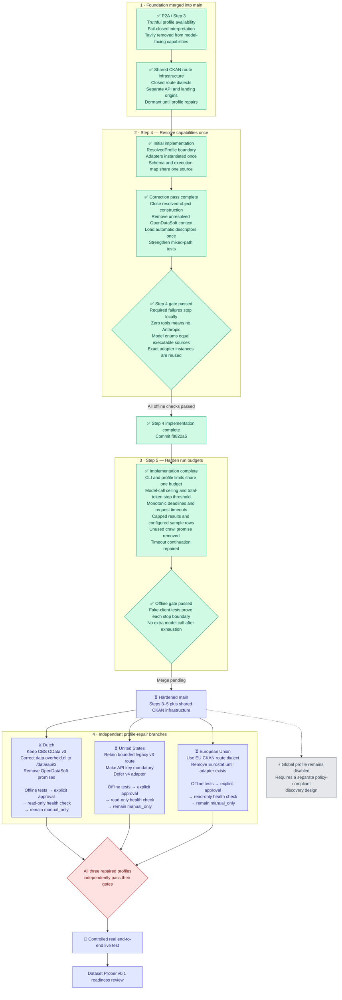

# Development roadmap
*Last updated: 15 August 2026*

```mermaid
flowchart TB
    subgraph Foundation["1 · Foundation merged into main"]
        P2A["✅ P2A / Step 3<br/>Truthful profile availability<br/>Fail-closed interpretation<br/>Tavily removed from model-facing capabilities"]
        CKAN["✅ Shared CKAN route infrastructure<br/>Closed route dialects<br/>Separate API and landing origins<br/>Dormant until profile repairs"]
        P2A --> CKAN
    end

    subgraph Step4["2 · Step 4 — Resolve capabilities once"]
        S4Initial["✅ Initial implementation<br/>ResolvedProfile boundary<br/>Adapters instantiated once<br/>Schema and execution map share one source"]
        S4Correction["✅ Correction pass complete<br/>Close resolved-object construction<br/>Remove unresolved OpenDataSoft context<br/>Load automatic descriptors once<br/>Strengthen mixed-path tests"]
        S4Gate{"✅ Step 4 gate passed<br/>Required failures stop locally<br/>Zero tools means no Anthropic<br/>Model enums equal executable sources<br/>Exact adapter instances are reused"}
        S4Initial --> S4Correction --> S4Gate
    end

    CKAN --> S4Initial
    S4Gate -->|"All offline checks passed"| S4Merge["✅ Step 4 implementation complete<br/>Commit f8822a5"]

    subgraph Step5["3 · Step 5 — Harden run budgets"]
        S5Work["✅ Implementation complete<br/>CLI and profile limits share one budget<br/>Model-call ceiling and total-token stop threshold<br/>Monotonic deadlines and request timeouts<br/>Capped results and configured sample rows<br/>Unused crawl promise removed<br/>Timeout continuation repaired"]
        S5Gate{"✅ Offline gate passed<br/>Fake-client tests prove each stop boundary<br/>No extra model call after exhaustion"}
        S5Work --> S5Gate
    end

    S4Merge --> S5Work
    S5Gate -->|"Merge pending"| Hardened["⏳ Hardened main<br/>Steps 3–5 plus shared CKAN infrastructure"]

    subgraph Repairs["4 · Independent profile-repair branches"]
        Dutch["⏳ Dutch<br/>Keep CBS OData v3<br/>Correct data.overheid.nl to /data/api/3<br/>Remove OpenDataSoft promises<br/><br/>Offline tests → explicit approval<br/>→ read-only health check<br/>→ remain manual_only"]
        US["⏳ United States<br/>Retain bounded legacy v3 route<br/>Make API key mandatory<br/>Defer v4 adapter<br/><br/>Offline tests → explicit approval<br/>→ read-only health check<br/>→ remain manual_only"]
        EU["⏳ European Union<br/>Use EU CKAN route dialect<br/>Remove Eurostat until adapter exists<br/><br/>Offline tests → explicit approval<br/>→ read-only health check<br/>→ remain manual_only"]
    end

    Hardened --> Dutch
    Hardened --> US
    Hardened --> EU

    Dutch --> ProfileGate{"All three repaired profiles<br/>independently pass their gates"}
    US --> ProfileGate
    EU --> ProfileGate

    Global["⏸ Global profile remains disabled<br/>Requires a separate policy-compliant<br/>discovery design"]
    Hardened -.-> Global

    ProfileGate --> Live["🎯 Controlled real end-to-end live test"]
    Live --> V01["Dataset Prober v0.1 readiness review"]

    class P2A,CKAN,S4Initial,S4Correction,S4Gate,S4Merge,S5Work,S5Gate done
    class ProfileGate gate
    class Hardened,Dutch,US,EU,Live,V01 pending

    classDef done fill:#d1fae5,stroke:#059669,color:#064e3b
    classDef active fill:#fef3c7,stroke:#d97706,color:#78350f,stroke-width:3px
    classDef pending fill:#e0e7ff,stroke:#4f46e5,color:#312e81
    classDef gate fill:#fee2e2,stroke:#dc2626,color:#7f1d1d
    classDef hold fill:#e5e7eb,stroke:#6b7280,color:#374151
    class Global hold
```
